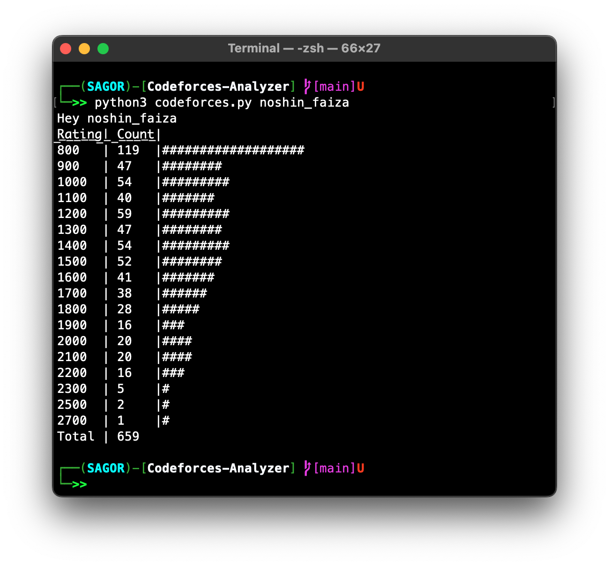
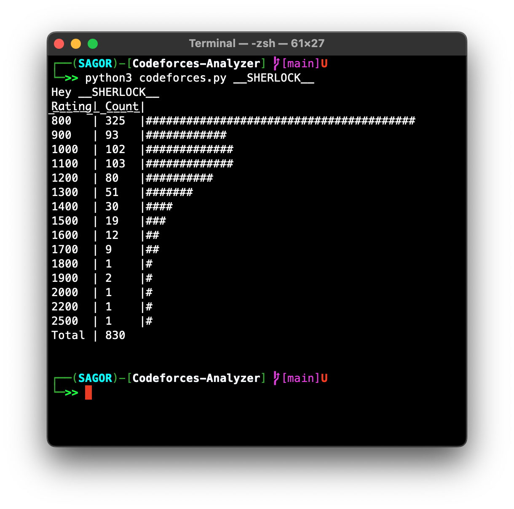

<h1 align="center">Codeforces Analyzer</h1>

## Features

- You can find out one's `How many` & `Which ratings` solved problems.

## Getting Started

Clone down or Download this repository. You will need `python` installed globally on your machine.

## Usage

* Run the script
  ```sh
  python3 codeforces.py <your-codeforces-handle>
  ```


## Visualization
<p>
   
  
  
</p>


